# JPEG Compression & Watermarking

Projek ini mengimplementasikan **JPEG compression** dari awal (menggunakan Python dan C) serta **penyisipan watermark visual** (citra biner) ke dalam domain frekuensi DCT.

| Foto Asli | Watermark |
|-----------|-----------|
|  |  |

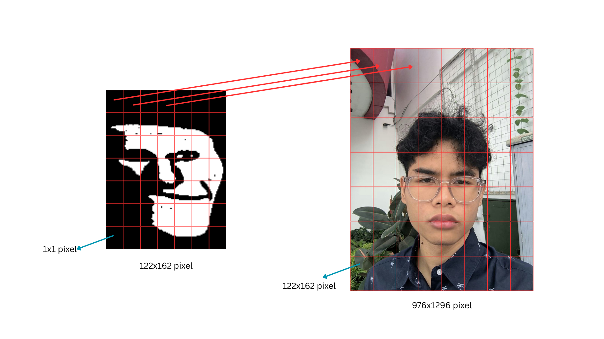

---

## Struktur Direktori

```

jpeg-compression-and-watermarking/
├── embedded.py              # Kompresi + watermarking
├── extracted.py            # Rekompresi + ekstraksi watermark
├── jpeg_encoder.c           # Minimalistic JPEG encoder (C)
├── foto-wajah.jpeg          # Contoh foto wajah (JPEG)
├── foto-wajah.ppm           # Contoh foto wajah (PPM)
├── README.md                    # Dokumentasi ini
├── watermark.png            # Citra watermark biner
└── visualizer/              # Script visualisasi tiap tahap
    ├── main.py              # Dekompresi + pemisahan watermark (versi lengkap)
    ├── visualize.py         # Visualisasi saluran RGB & YCbCr
    ├── padding.py           # Padding gambar ke kelipatan 8
    ├── chroma_subsampling.py# Simulasi chroma subsampling 4:2:0
    ├── kuantisasi.py        # Visualisasi DCT & kuantisasi
    ├── zigzag.py            # Contoh proses zig-zag & DC difference
    └── resize_watermark.py  # Resize & binerisasi watermark
```

---

## Alur Kompresi JPEG + Watermarking (Python)

### 1. Baca PPM & Konversi RGB → YCbCr (`embedded.py:111-174`)
- Baca file `.ppm` (format P6)
- Ambil dimensi, hitung padding ke kelipatan 8 (`N_W`, `N_H`)
- Konversi tiap piksel: RGB → YCbCr (standar ITU-R BT.601)
- Area padding diisi `Y=0, Cb=128, Cr=128`

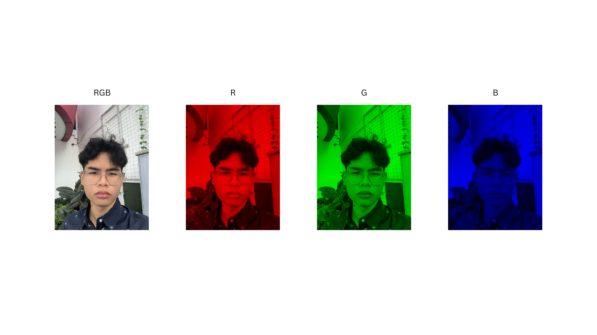
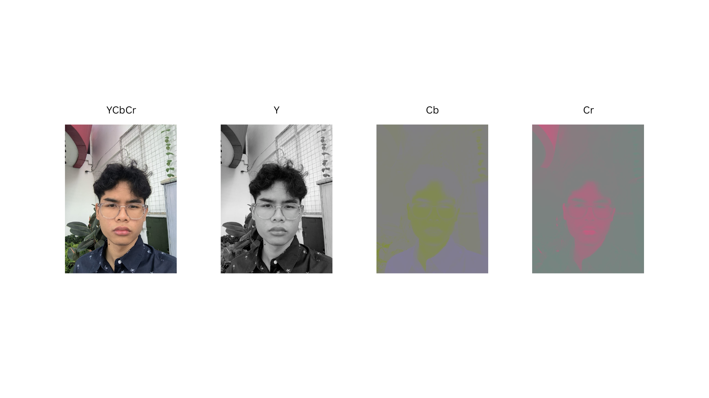
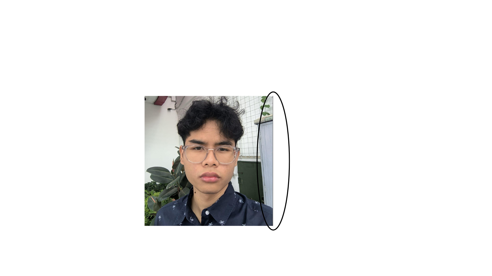

### 2. Chroma Subsampling 4:2:0 (`embedded.py:176-214`)
- Rata-rata blok 2×2 untuk Cb dan Cr
- Ukuran Cb/Cr menyusut setengah (`sub_width = N_W/2`)

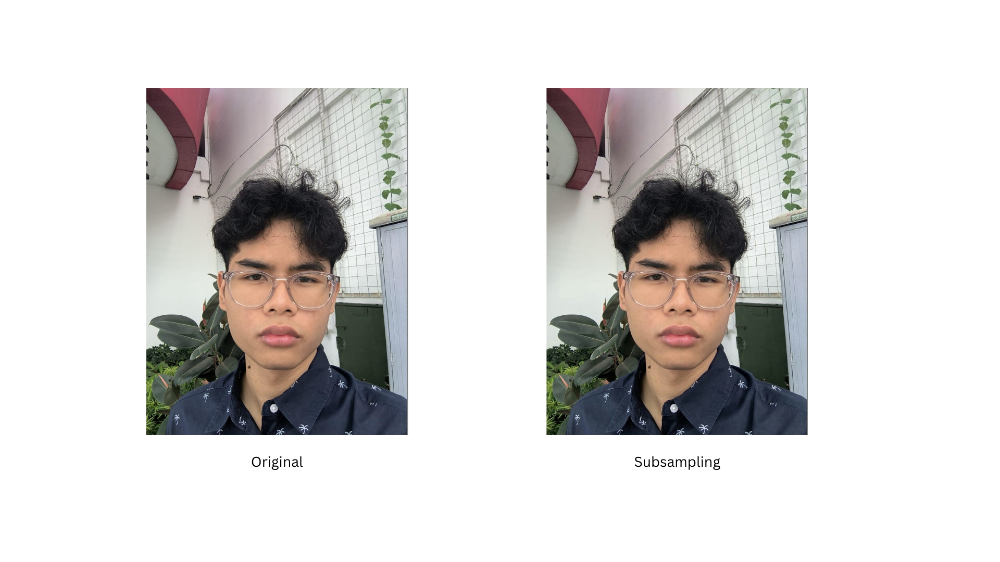

### 3. DCT 8×8 per Blok (`embedded.py:217-301`)
- Level shifting (-128)
- 2D DCT terpisah (Separable): vertikal dulu, lalu horizontal
- Gunakan lookup table cosinus agar cepat
- Hasil: 64 koefisien frekuensi per blok (DC + 63 AC)

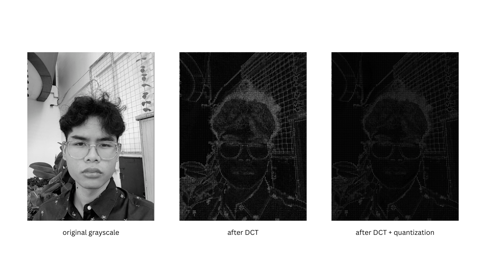

### 4. Sisipkan Watermark Biner (`embedded.py:303-353`)
- Baca watermark PNG, konversi ke biner (1-bit)
- Ukuran watermark = grid blok DCT (lebar/8 × tinggi/8)
- Penyisipan: `C'[19] = C[19] + α × bit_watermark`
- Koefisien indeks 19 = frekuensi menengah (mid-band)
- `α = 200` (kekuatan watermark)

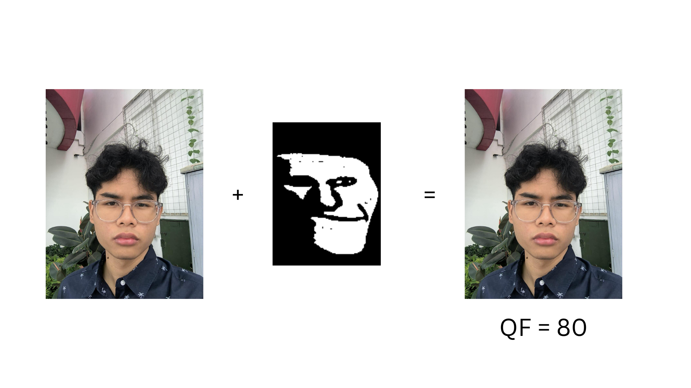

### 5. Kuantisasi (`embedded.py:355-414`)
- Scale tabel kuantisasi standar JPEG (T.81) berdasarkan `quality`
- Bagi tiap koefisien DCT dengan nilai tabel kuantisasi
- Luma pakai `luma_q`, Chroma pakai `chroma_q`

### 6. Zig-zag, RLE & DC Difference (`embedded.py:416-449`)
- Urutkan 64 koefisien secara zig-zag (frekuensi rendah → tinggi)
- Hitung selisih DC antar blok berurutan (DPCM)

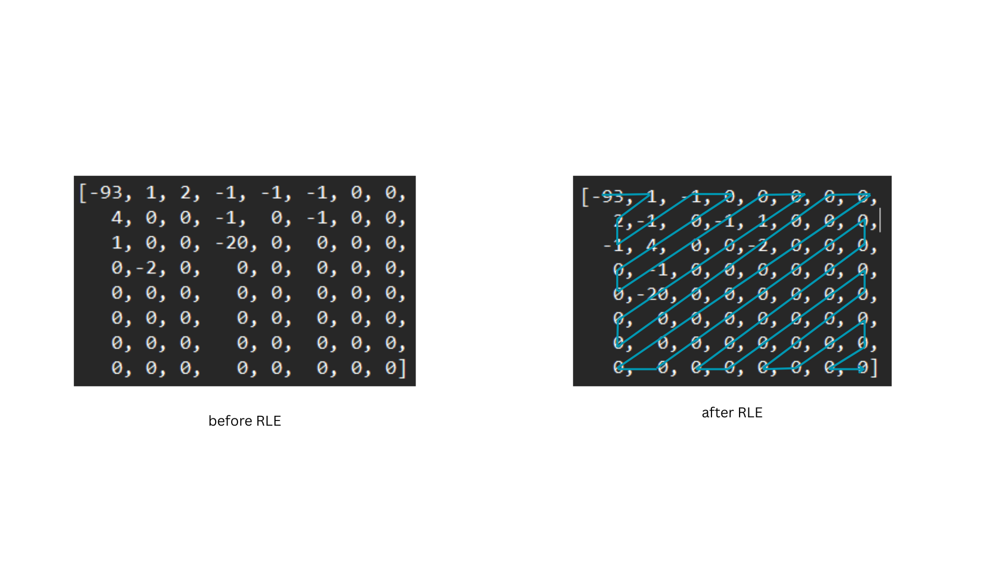

### 7. Entropy Coding (Huffman) (`embedded.py:451-497`)
- Gabung semua blok Y, Cb, Cr jadi satu stream
- Gunakan library `dahuffman` untuk membuat Huffman tree dinamis
- Simpan hasil kompresi + metadata ke `.pkl`

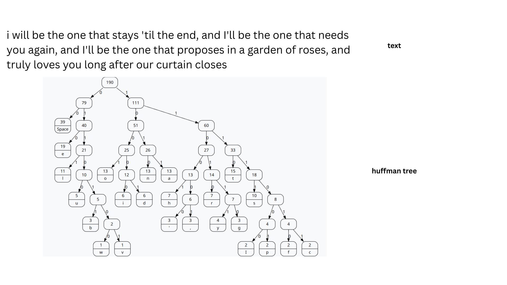

---

## Alur Dekompresi (`extracted.py`)

1. Baca paket `.pkl` (Huffman codec, data biner, metadata)
2. Decode Huffman → stream koefisien
3. Pisahkan stream Y/Cb/Cr, inverse DPCM, inverse zig-zag
4. Dekuantisasi (× tabel kuantisasi)
5. Inverse DCT 2D (via `scipy.fftpack.idct`)
6. Upsampling Cb/Cr (replikasi 2×2), rekonstruksi YCbCr → RGB
7. **Ekstrak watermark**: baca tanda koefisien indeks 19 tiap blok Y

---

## JPEG Encoder C (`jpeg_encoder.c`)

Encoder minimalis dari Schier Michael (April 2011), fitur:
- Baseline DCT, chroma subsampling 4:2:0
- Dynamic Huffman table (4 tabel: luma DC/AC, chroma DC/AC)
- Output file `.jpg` sesuai spesifikasi JPEG
- Usage: `./jpeg_encoder <file.ppm> <quality>`

---

## Visualizer

| File | Fungsi |
|------|--------|
| `visualize.py` | Pisah saluran RGB & YCbCr, simpan visualisasi tiap channel |
| `padding.py` | Tambah padding kanan/bawah agar dimensi kelipatan 8 |
| `chroma_subsampling.py` | Simulasi efek subsampling 4:2:0 pada warna |
| `kuantisasi.py` | Visualisasi spektrum DCT & efek kuantisasi (log-scale) |
| `zigzag.py` | Contoh urutan zig-zag pada blok 8×8 |
| `resize_watermark.py` | Ubah ukuran & binerisasi gambar watermark |
| `main.py` | Dekompresi lengkap + hasilkan 3 output (watermarked, bersih, watermark) |

---

## Parameter Penting

| Parameter | Nilai | Keterangan |
|-----------|-------|------------|
| `WM_INDEX` | 19 | Indeks koefisien DCT mid-band untuk watermark |
| `ALPHA` | 200 (compres.py) / 10 (visualizer) | Kekuatan penyisipan watermark |
| `TARGET_KUALITAS` | 80 | Quality scale kuantisasi JPEG |
| Subsampling | 4:2:0 | Rasio chroma subsampling |

---

## File Output

| File | Deskripsi |
|------|-----------|
| `compress.pkl` | Paket kompresi (Huffman codec + data + metadata) |
| `ekstrak_watermark.png` | Watermark biner hasil ekstraksi |
| `gambar_watermark.png` | Foto dengan watermark (dari visualizer/main.py) |
| `gambar_tanpa_watermark.png` | Foto hasil bersihkan watermark (dari visualizer/main.py) |

---

## Hasil Uji Coba Quality Factor (QF)

| QF | Gambar dengan Watermark | Ekstrak Watermark |
|----:|------------------------|-------------------|
| 100 |  |  |
| 90 |  |  |
| 80 |  |  |
| 70 |  |  |
| 60 |  |  |
| 50 |  |  |
| 40 |  |  |
| 30 |  |  |
| 20 |  | 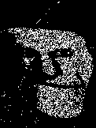 |
| 10 |  | 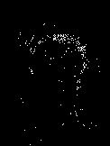 |
